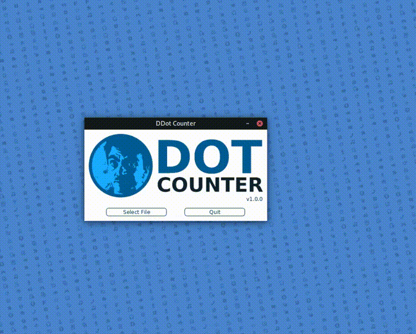

# DDot Counter

A program to count dots within images. Primarily designed for quick, simple, and automated counting of bacterial colonies from images of plates.

Alongside total plate counts, DDot Counter can also be used to divide a plate into sections (e.g. for counting different experimental conditions on a single plate) and to process multiple images with consistent settings.

All results can be exported as CSVs containing the counts and JPEG images highlighting the detected dots.

## Installation

To install, simply download the zip file for your operating system from the executables folder, extract, and run the executable (may also require Java installation).
Mac version will be coming soon. The cloned the source code can also be run using Processing.

## Using DDot

### Instructions

DDot counter is broken down into three main stages:

#### 1. Image processing

If desired, images can be modified to improve clarity of the dots using any combination of an RGB filter to amplify specific colours, a greyscale filter to remove colour, a dilation mode that boosts dot size, and a cropping tool to remove areas outside the region of interest.

#### 2. Dot identification

Dots are found by first converting the image to black and white pixels via a process termed thresholding. The thresholding parameter should be set to find a balance where dots are best differentiated from one another.

The thresholded image is then converted into a distance map using a mapping resolution value. This allows splitting of dots (or bacteria) that may be overlapping. Again, adjusting the resolution can be used to find a balance between correctly splitting joined colonies and artificially splitting single dots.

#### 3. Dot counting

Once parameters have been set, the counting algorithm can be run to get the total number of dots in the image. Individual sections (such a streaks for different experimental conditions) can also be set and sub-counts will be calculated for each. 

Count data can be saved to files using the export button. Choose a directory and type a filename (without extension). DDot will then export a CSV containing the counts (total and per section) and a JPEG of the processed image. The csv will also store all image processing settings for future reference.

#### Repeat image processing

If you have multiple images (such as multiple plates from an experiment) it might be desirable to process them with the same settings. This can be done using the settings from exported CSVs as a reference. However, if you close the image window and open the next file (without exiting DDot) all settings will be preserved, allowing quick and uniform processing of multiple images.

## Technical details

DDot Counter was written using Processing and is based around the watershed algorithm described in Bieniek and Moga, Pattern Recognition, 2000.

It was originally written to help Danny ([@DannyJohnston2](https://twitter.com/DannyJohnston2)) count his bacterial colonies, he is the face of DDot.
